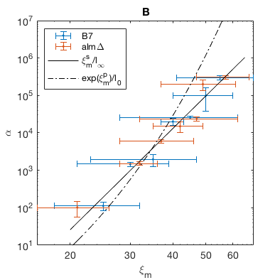

Figure 2: Many beautiful positive controls of
of growth
in the ??? system.
In panel A, we show the response of teta
, in units of mg ([0, 1000])
/week,
as .2 increases.
Several values of alpha are shown.
Using different values of alpha
allows us to infer ???
from observations of ???
in ???.
<<<<<<< HEAD
In panel B, we compare the resulting estimations of ???
in units of cm/s.
Data are shown for two conditions, wild type and formin knockout.
Overlaid curves are best fits of the precessive model
and the one stage reduction model.
=======
In panel B, we compare the resulting estimations of Effective Lobster Dancing coefficient
in units of log(Lobsters per Lobster trap).
Data are shown for two conditions, lobsters boiled in salt water (B7) and raw lobsters (alm).
Overlaid curves are best fits of the ??? model
and the ??? model.
>>>>>>> 5dea9721b88e0d9d439c6dc4bd0810479ba13720
